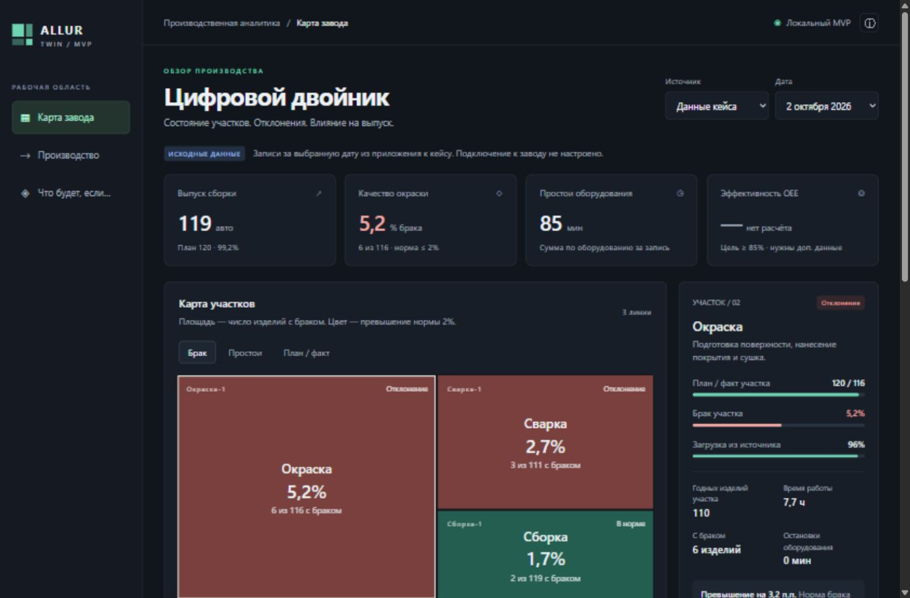

# Allur Twin

MVP цифрового двойника автомобильного завода для кейса №2 Qostanai Industry Hackathon 2026. Главный экран — интерактивная карта прямоугольников в стиле биржевого treemap: масштаб потерь виден по площади, состояние — по цвету.



## Быстрый запуск

**Без установки:** откройте `dist/index.html` двойным щелчком. Все основные функции работают локально и без интернета.

**Через локальный сервер:** установите Node.js 20 или новее с [официального сайта](https://nodejs.org/), откройте терминал в папке проекта и выполните:

```sh
npm start
```

Откройте **http://127.0.0.1:4173**. На Windows можно также запустить `start.cmd`. Зависимости устанавливать не нужно: приложение и сервер используют только стандартные возможности браузера и Node.js.

## Что работает

- **Карта завода:** три режима — брак, простои и план/факт. Площадь и цвет имеют пояснения; линии с нулевыми потерями доступны отдельной кнопкой.
- **Карточки участков:** выпуск, план, загрузка, брак, время работы, остановки и факты для проверки. Выбор прямо на карте.
- **Демо оборудования:** 18 интерактивных ячеек в трёх участках; синтетическая нагрузка, остановка и восстановление ABB-01.
- **Производственная цепочка:** шесть этапов, от склада комплектующих до склада готовой продукции; сравнение выпуска годных изделий на час работы.
- **Автосводка:** прозрачные правила и статистика с числовыми основаниями. Сводку можно скопировать.
- **Симуляция «Что будет, если…»:** участок остановки, длительность, запас между этапами и скорость; график выпуска сборки, потери и остатки запасов.
- **Живой демонстрационный поток:** шесть событий, автоматический шаг каждые пять секунд, пауза, ручной шаг и повтор.
- **Адаптивный интерфейс:** компьютер и узкий мобильный экран; доступные с клавиатуры кнопки и поля.

## Данные

Данные кейса перенесены из документа «Тестовые данные для кейса “Цифровой двойник завода”»: записи линий за 1 и 2 октября 2026, остановки оборудования, планы моделей и контрольные пороги. Числовые записи находятся в `dist/data.js`, отдельная копия — в `data/case-data.json`.

Источник **«Данные кейса»** показывает предоставленные записи. Источник **«Демо событий»** показывает отдельный синтетический сценарий: оборудование, его нагрузки и события не являются измерениями предприятия.

Исходные PDF и DOCX в репозиторий не включены. Добавляйте их только при наличии разрешения на распространение.

### Правила расчёта

| Показатель | Правило |
| --- | --- |
| Выполнение плана | Факт / план × 100% |
| Брак участка | Дефектные изделия / выпуск участка × 100% |
| Выпуск сборки | Только выпуск последнего участка с числовыми данными |
| Простои оборудования | Сумма оборудования-минут, а не время простоя завода |
| Кандидат на узкое место | Минимум (выпуск − брак) / время работы среди участков |

На карте брака площадь пропорциональна количеству дефектных изделий. На карте простоя — сумме минут. На карте план/факт — плану. В демонстрационном режиме площадь остаётся пропорциональна плану, чтобы оборудование сохраняло читаемые размеры.

**Ограничения исходных данных:** планы моделей суммарно дают 4800 автомобилей при общей цели 5500; принадлежность записей сменам не уточнена; OEE нельзя достоверно вычислить; запасы между этапами неизвестны. Эти сведения доступны в приложении по кнопке ⓘ.

## Симуляция

Модель проводит поток через сварку → окраску → сборку с шагом 0,25 минуты. Для одинаковых исходных условий сравниваются смены с остановкой и без неё. В каждом шаге учитываются выпуск upstream-этапов и доступный запас downstream-этапам.

По умолчанию: одна смена 8 часов, скорость 15 условных изделий/час на каждом этапе, остановка окраски на 30 минут через 2 часа после начала, начальные запасы по 4 изделия. Результат: базовый выпуск 120, сценарный 116,5, потеря 3,5 условных изделия. Сварка продолжает работать и накапливает запас перед окраской.

Допущения: постоянная одинаковая скорость этапов, мгновенная передача, достаточное место для накопления, отсутствие брака и переналадок. Дробные результаты относятся к непрерывной модели, не к фактическому количеству готовых автомобилей. Увеличение буфера может сохранить выпуск текущей смены, но уменьшает запас к её концу.

## Проверка

```sh
npm test
```

12 тестов проверяют исходные формулы, отсутствие двойного счёта выпуска, геометрию treemap, нулевые потери, влияние буферов, остановки на границе смены, сохранение потока и монотонность демонстрационных накопленных показателей. Тесты используют встроенный `node:test`.

Сведения о проведённой проверке интерфейса: [docs/QA.md](docs/QA.md).

## Выложить в GitHub

1. Создайте пустой репозиторий, например `allur-twin`.
2. Загрузите **содержимое этой папки** в корень репозитория: `dist`, `docs`, `data`, `tests`, `.github`, `package.json` и остальные файлы. Не загружайте только ZIP.
3. Если используете Git локально:

```sh
git init
git add .
git commit -m "Add Allur Twin hackathon MVP"
git branch -M main
git remote add origin https://github.com/YOUR_USERNAME/allur-twin.git
git push -u origin main
```

Замените `YOUR_USERNAME` своим именем пользователя. Команда push требует вашей авторизации в GitHub.

### Опубликовать приложение через GitHub Pages

1. В репозитории откройте **Settings → Pages → Build and deployment → Source: GitHub Actions**.
2. Откройте **Actions → Publish GitHub Pages → Run workflow** на основной ветке.
3. После успешного выполнения адрес приложения появится в задании `deploy` и в разделе Pages.

Публикуется только папка `dist`. Workflow публикации запускается вручную. Отдельный workflow **Check MVP** запускает тесты при push и pull request. Публикация на GitHub в процессе подготовки MVP не выполнялась.

Конфигурация использует официальный подход [GitHub Pages для собственных workflows](https://docs.github.com/en/pages/getting-started-with-github-pages/using-custom-workflows-with-github-pages) и [пример для статического сайта](https://github.com/actions/starter-workflows/blob/main/pages/static.yml).

## Структура

```text
dist/
  index.html       # интерфейс
  styles.css       # адаптивное оформление
  app.js           # взаимодействия и отображение
  data.js          # исходные данные и демо-сценарий
  engine.js        # метрики, карта, правила и симуляция
  favicon.svg
data/case-data.json
tests/engine.test.cjs
docs/
  ARCHITECTURE.md
  DEMO.md
  QA.md
  overview.jpg
server.mjs         # локальный статический сервер
start.cmd          # запуск сервера на Windows
.github/workflows/
```

Архитектура и путь дальнейшего развития: [docs/ARCHITECTURE.md](docs/ARCHITECTURE.md). Сценарий защиты: [docs/DEMO.md](docs/DEMO.md).

## Границы MVP

Это демонстрационный цифровой двойник. Реальная телеметрия, база данных и языковая модель не подключены. Автосводка работает по правилам, а симуляция моделирует сценарий. Настоящее прогнозирование поломок потребует более длинной истории, данных датчиков и проверки качества модели.

Для следующей версии предусмотрена замена источника данных, подключение серверной аналитики и языковой модели с сохранением числовых оснований выводов. API-ключи должны храниться на сервере, а не в статическом клиенте. Выберите лицензию проекта перед публичным распространением исходного кода.
