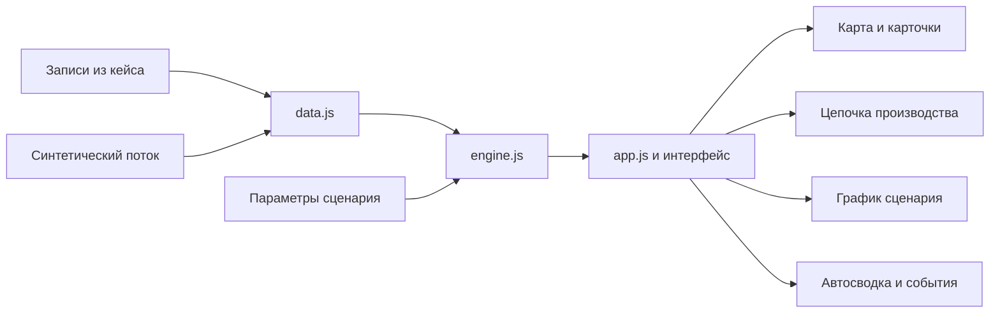

# Архитектура Allur Twin

Приложение показывает состояние производства, объясняет числовые отклонения и сравнивает сценарии остановки. Версия MVP полностью работает в браузере; данные хранятся в поставляемых файлах. Локальный сервер нужен только для раздачи статических файлов.



## Обязанности модулей

| Модуль | Ответственность |
| --- | --- |
| `data.js` | Справочник трёх участков, записи линий, остановки, месячные планы, пороги и синтетические снимки |
| `engine.js` | Чистые функции метрик, выявления отклонений, текста сводки, squarified treemap и симуляции |
| `app.js` | Состояние выбранной даты и представления, события кнопок, отрисовка, таймер демо |
| `styles.css` | Тёмная тема и адаптивная компоновка |
| `server.mjs` | Раздача только файлов из `dist` через loopback; JSON API отсутствует |

## Модель записи

```json
{
  "date": "2026-10-02",
  "stage": "paint",
  "plan": 120,
  "actual": 116,
  "hours": 7.7,
  "load": 96,
  "defects": 6
}
```

`actual` — количество изделий, обработанных данным участком. `defects` — дефектные изделия участка. `load` — отдельный процент загрузки из источника. Он не используется как замена OEE. `hours` — время работы из записи, принадлежность которой конкретной смене не уточнена.

Остановка содержит дату, участок, оборудование, причину и длительность. Начало, конец и критичность оборудования отсутствуют, поэтому пересечения интервалов и общий простой линии не вычисляются. Плановое ТО и неисправности обозначены отдельно.

## Поток симуляции

Параметры: участок, длительность, скорость и начальный запас в каждом из двух буферов. При шаге 0,25 минуты рассчитываются доступные мощности этапов и выпуск:

```text
q1 = доступная мощность сварки
q2 = min(доступная мощность окраски, запас1 + q1)
q3 = min(доступная мощность сборки, запас2 + q2)
запас1 += q1 - q2
запас2 += q2 - q3
выпуск сборки += q3
```

Во время остановки мощность выбранного этапа равна нулю. Запасы неотрицательны, а поток сохраняется: исходные запасы + выпуск сварки = конечные запасы + выпуск сборки. Остановки, пересекающие конец смены, обрезаются границей расчёта.

Результат рассчитан для непрерывного потока, поэтому содержит дробные условные изделия. Модель не включает длительности отдельных операций, брак, переналадки, блокировку при переполнении или ускорение после остановки. Сопоставление с реальным заводом требует калибровки и проверки.

## Интеграция следующей версии

1. **Телеметрия:** адаптер принимает реальные события состояния оборудования с идентификаторами и временем начала/конца. Замена `snapshot()` в `app.js` подключает нормализованный источник к существующим представлениям.
2. **Сервер и история:** API, постоянное хранение, журнал событий и контроль свежести данных. Для реального потока подходят опрос API, SSE или WebSocket.
3. **Языковая модель:** серверный обработчик получает уже рассчитанные факты и создаёт объяснение с перечислением числовых оснований. Ключи и обращения к модели остаются на сервере; расчёт показателей выполняет движок.
4. **Прогноз:** собираются данные датчиков, отказы и ремонты за достаточный период. Качество прогноза проверяется на отложенной истории. Правила MVP не заменяют проверенную модель отказов.
5. **OEE:** требуется согласовать плановое производственное время, доступность, идеальную скорость и качество. Цель 85% уже известна, составные данные пока отсутствуют.

Метки демонстрационных и реальных данных, контроль отсутствующих значений и объяснение расчётов должны сохраняться при интеграции.
